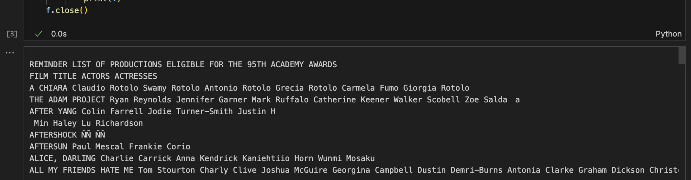

# Econ 5166 Project Proposal（範例）

- Author: Yu-Chang Chen
- Date created: 20250828
- Source: [Google 文件](https://docs.google.com/document/d/1cTVvHdPR0MJYz7FrR9WZS7abSe4ZAyJoXvhlM8IUgEw/edit?tab=t.0#heading=h.u4v9mlb5wwtg)

第 1 組

成員：

B09303XXX 陳XX

B09303XXX 葉XX

B09303XXX 林XX

B09303XXX 林XX

B09303XXX 林XX

## 1. 專案敘述：研究問題、動機與研究方法（組員共同討論，PM 彙整）

請簡單描述研究問題與動機。研究方法方面，請討論預計所使用的資料以及研究設計，如想要計算的敘述統計量、統計圖表或是迴歸模型。

### 研究問題

本次研究問題主要是針對 10 年內（2013-2020）奧斯卡金像獎最佳男女主角與配角的非華人得獎者跟入圍者名單是否有受「政治正確」影響。

### 研究動機

在現今社會中，由於近年的種族問題，許多人在追求所謂的「政治正確」，但是矯枉過正，使得越來越多人為此感到反感。2016 年與 2017 年入圍者的種族組成截然不同，透過這次的研究，我們想探討奧斯卡這樣應該是以專業人士的標準—以演員的演技及電影內容—去做入圍的評斷，是否也受到政治正確的影響（以種族為例）。

### 資料來源

以下是我們的資料來源：

1. 每年報名奧斯卡提供的官方名單（[https://www.oscars.org/sites/oscars/files/reminder_list_productions_eligible_95_oscars.pdf](https://www.oscars.org/sites/oscars/files/reminder_list_productions_eligible_95_oscars.pdf) ）
2. IMDB 上過去曾經入圍過奧斯卡的名單
3. 公布的男女主角和配角入圍名單
4. 透國爬蟲取得的爛番茄電影評分

### 研究方法

利用 OLS 在控制了演員的能力（曾被提名之紀錄）及電影品質（電影評分）之下找出一位演員能夠入圍的機率與他的種族（簡單分為白人與非白人）有沒有相關性。

模型雛形：

## 2. 已有之 raw data

請由 DE 將目前已抓到的 raw data 印出幾個範本。此問題之目的在於確定關鍵資料可取得。

已將奧斯考報名之名單從 pdf 檔轉為文字。

## 3. 主要分析用資料需求（組員共同討論，DA 負責撰寫，DE 確認可執行）

請以下表描述最終需要的格式化資料，並請提供詳細的規格，包含樣本時間（如 2022 — 現在）、範圍（如台北市 or 某某產業）⋯⋯等輔助資訊。

樣本時間：2013-2022

範圍：報名奧斯卡男主角、女主角、男配角、女配角以及最後有入圍之名單

| Title | Name | Race | Gender | Nominated | Year | Nominated Before | Movie Score |
| --- | --- | --- | --- | --- | --- | --- | --- |
| La La Land | Ryan Gosling | 0 | 0 | 1 | 2017 | 1 | 91 |
| Gone Girl | Carrie Coon | 1 | 1 | 0 | 2015 | 0 | 88 |
| … | … | … | … | … | … | … | … |

## 4. 假說與預期主要結果（組員共同討論，DA 負責撰寫）

請描述你們的假說，可以搭配（假想的）統計圖表或是迴歸模型做解釋。P.S. 想要製作 data application 的組別，請提供 UI 示意圖。

在 2016 年奧斯卡結果出爐後，不少媒體、以及輿論紛紛指出入圍者皆是白人，懷疑評審團有對白人優待的行為；結果在隔年，2017 年，入圍名單非白人比例大幅提高。

我們的假說是上述現象的發生可能來自於受到「政治正確的」壓力影響所導致的入圍者種族比例截然不同的結果。

因此，我們預期在 2017 年之結果上，將會是正的。而前一年 2016 年的將會是負的，也就是對種族政治正確的考慮確實影響奧斯卡評選結果。

## 5. 預期限制（組員共同討論，DA 負責撰寫）：

請描述最終的研究結果可能會面臨哪些限制或挑戰。某些資料無法取得？測量誤差？內生性？⋯⋯

基本上沒有人對應到是否是白人的資料，在種族這個欄位的資料必須透過人工標記。十年的名單將會是很大的工作量。另外，對於白人或非白人的定義我們無法完全準確的判斷一位演員是復否為「高加索人種」，只能透過照片、出生地和生父生母國籍參考。

## 6. 角色分工表：請列出組員之分工（PM 彙整）

- Project manager: 陳XX
- Data engineer: 林XX 林XX
- Data analyst: 葉XX 林XX
